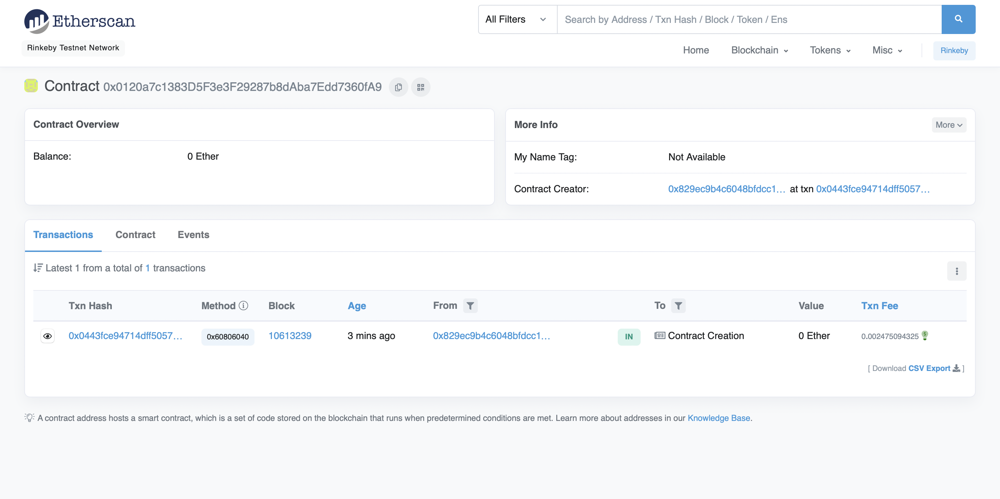
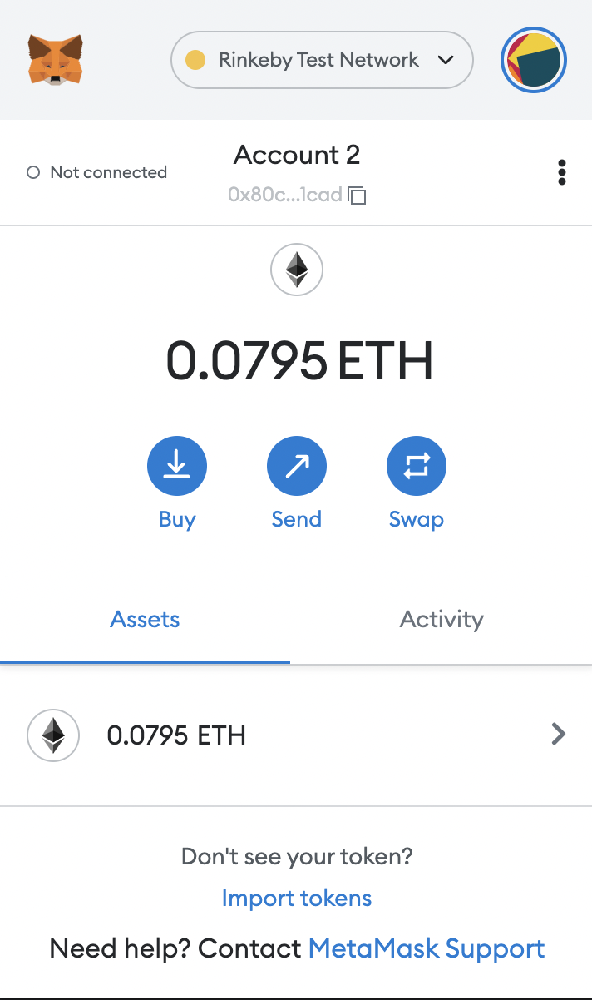
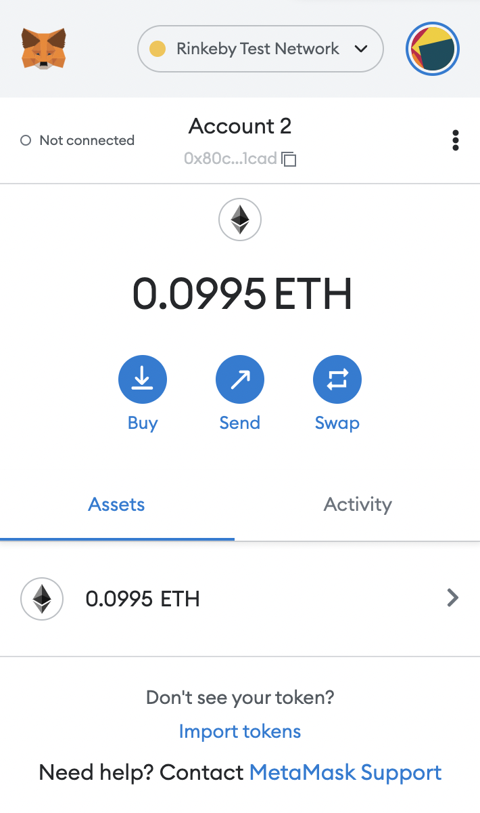
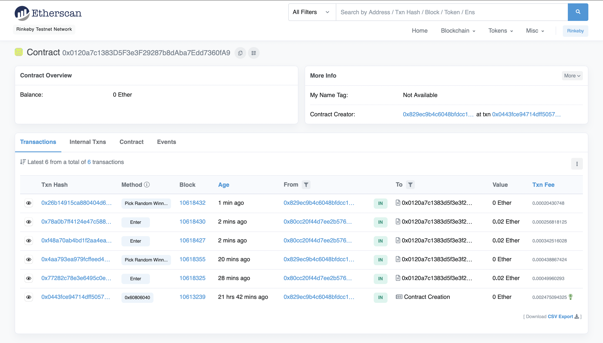

# Smart Contract: Lotery
In this repo you can find a simple realisation of lotery in smart contract.

*__Contract chain:__ [Rinkeby](https://rinkeby.etherscan.io/address/0x0120a7c1383D5F3e3F29287b8dAba7Edd7360fA9)*<br>
*__Contract address:__ 0x0120a7c1383D5F3e3F29287b8dAba7Edd7360fA9*



# Rules
Any real wallet can participate in the Lotery. The minimum requirement is that you should send >0.01 ETH when entering. Smart contract chooses one winner and send all enter funds to the winner's wallet. After the winner is picked the list of participants is cleared.

# Functions
- `getBalance() -> uint`: returns the current balance of the Smart Contract

- `getParticipants() -> address[]`: returns the list of partisipants' addresses

- `enter() -> none`: checks the amount of sent ether and pushes participant to the Lotery

- `getRandom() -> uint`: returns the random number based on timestamp

- `pickRandomWinner() -> address`: picks the winner and returns it's address, send funds to the winner's wallet (can be called only by  the deployer of the contract)

# Structure
[contracts/](contracts/) contains Smart Contract source code.

[data/](data/) contains file with test addresses in the following format. You can add your _existing_ wallet in Rinkeby chain.
```json
[
    {
        "address": "0x3...fk", // wallet address
        "private": "PRIVATE_KEY_1", // name of the env var with private key
        "value": 0.02 // value to send to enter the lotery in ether
    },
    ...
]
```
[migrations/](migrations/) contains files for deployment.

[scripts/](scripts/) contains client to interact with the deployed contract.

[test/](test/) contains JavaScript tests for the contract (not fully covered). Run with the following:

1) Compile Smart Contracts
```bash
truffle compile
```
2) Migrate Smart Contracts
```bash
truffle migrate
```
3) Run JS test cases
```bash
truffle test
```

[tests/](tests/) contains python tests. Run with the following:
```bash
brownie test
```
------

**NOTE:** Don't forget to add `.env` file (ignored by git) for private key info corresponding to JSON-file in data:
```
PRIVATE_KEY_0=qdcow3...92ck
PRIVATE_KEY_1=sdlkfj...sfdf
```
For Linux/MacOS run:
```bash
source .env
```

# Deploying
Deploying logs can be found [here](migration.log).  Deployed contract to interact with can be reached by python client by running:
```bash
python3 scripts/client.py
```
You should see something like this:
```
Initial Lotery Balance: 0
Entering participant:  0x80cC20f44D7EE2b576617951eB58593a3E681cad
Done!
Current Lotery Balance: 20000000000000000
The winner is: 0x80cC20f44D7EE2b576617951eB58593a3E681cad
Prize fund is sent to the winner`s address!
```
Here is the test partisipating account in Rinkeby chain. Inittially it had 0.1 ETH. Then spent 0.2 ETH (+gas) to enter and the second picture displayes the state after winning.
<p float="left">
  
  
</p>

Below there are the resuls in Rinkeby:

